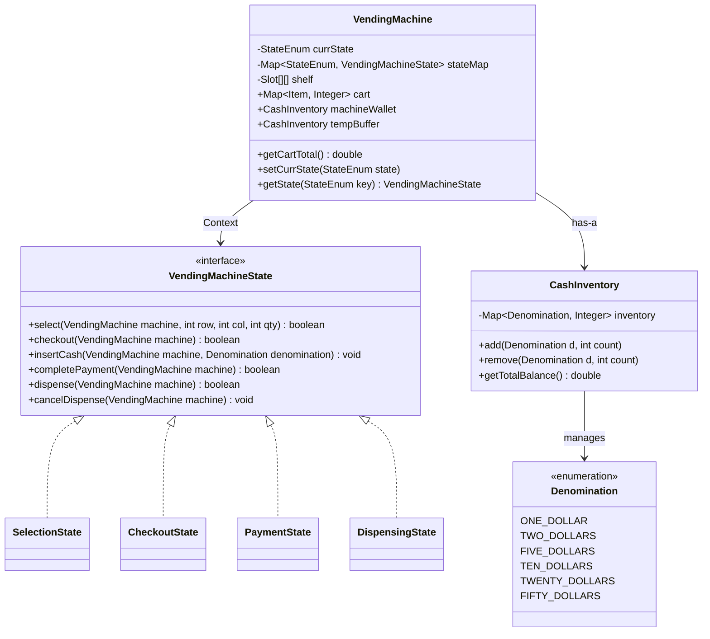
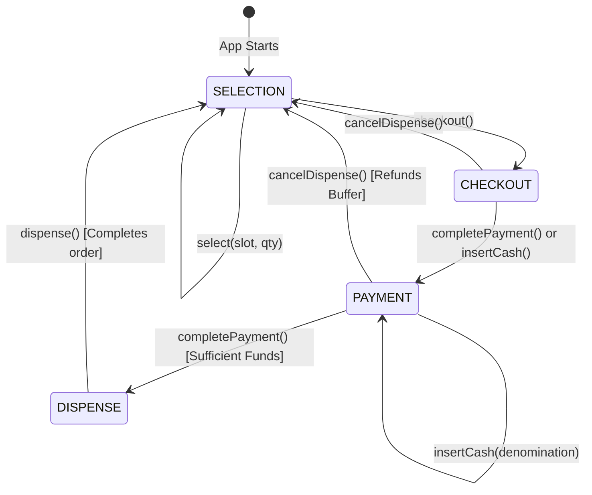

# Vending Machine - Low Level Design (LLD)

This project implements a fully functional Vending Machine simulation in Java. It heavily relies on the **State Design Pattern** to handle the transitions during the user's interaction flow and features a robust **Cash Management System** to handle real-world denominations and change dispensing.

---

## 🏛️ Architecture Overview

The application is structured into the following key packages:
- `com.vendingmachine.machine`: Contains the `VendingMachine` class which acts as the **Context** for the state pattern.
- `com.vendingmachine.state`: Contains the `VendingMachineState` interface and all concrete states.
- `com.vendingmachine.model`: Contains domain models like `Item`, `Slot`, `Denomination`, and `CashInventory`.
- `com.vendingmachine.utils`: Utility helpers for parsing user inputs.

### 📐 Class Diagram



---

## 🔄 State Machine Diagram

The core of the vending machine relies on transitioning seamlessly across different states. Below is the state machine representation.



---

## 💻 Core Components

### 1. State Pattern Interface
All concrete states implement the `VendingMachineState` interface. This enforces that each state handles the standard flow methods, gracefully rejecting operations that do not apply to the current state (e.g., rejecting item selection during payment).

```java
public interface VendingMachineState {
    boolean select(VendingMachine machine, int row, int col, int qty);
    boolean checkout(VendingMachine machine);
    void insertCash(VendingMachine machine, com.vendingmachine.model.Denomination denomination);
    boolean completePayment(VendingMachine machine);
    boolean dispense(VendingMachine vendingMachine);
    void cancelDispense(VendingMachine machine);
}
```

### 2. Cash Management (`CashInventory`)
Instead of tracking a simple `double` amount, the system uses physical-like `Denominations`. 
- **`tempBuffer`**: Tracks the bills inserted by the user during a transaction.
- **`machineWallet`**: Tracks the global bills in the machine, ensuring the machine can actually provide the required physical change.

During `completePayment()` in `PaymentState`, the machine compares `tempBuffer.getTotalBalance()` against the cart's required total. If funds are sufficient, change is evaluated, and the buffer is merged into the wallet.

```java
// Example logic in PaymentState.java
double inserted = machine.tempBuffer.getTotalBalance();
double required = machine.getCartTotal();
double change = inserted - required;

if (change > 0 && machine.machineWallet.getTotalBalance() < change) {
    System.out.println("Machine does not have enough change. Refunding.");
    cancelDispense(machine);
    return false;
}
```

### 3. Interactive CLI Engine
The `App.java` features a custom REPL (Read-Eval-Print Loop) to act as the front-end simulation for the Vending Machine hardware.

```java
// Command Support:
// > select A0 2
// > checkout
// > insert 10
// > pay
// > dispense
// > cancel
```
